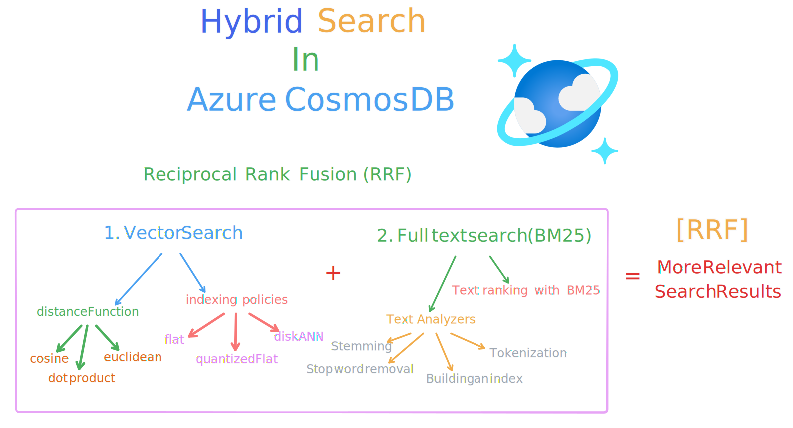
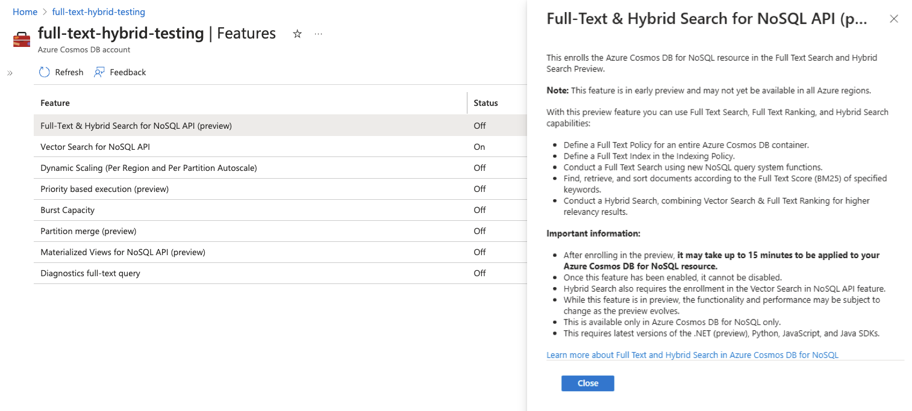
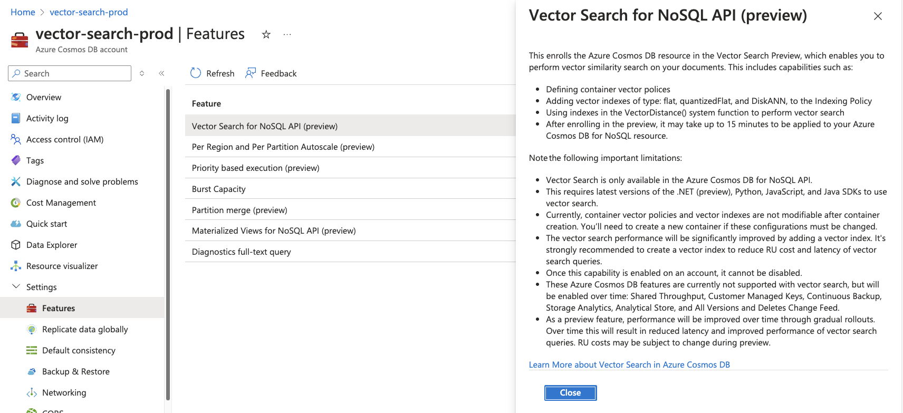

# Hybrid Search with Azure Cosmos DB
Azure Cosmos DB for NoSQL now supports a powerful hybrid search capability that combines Vector Search with Full Text Search scoring (BM25) using the Reciprocal Rank Fusion (RRF) function.


<a href="https://learn.microsoft.com/azure/cosmos-db/gen-ai/hybrid-search?WT.mc_id=MVP_406617"  target="_blank">

</a>

## Enterprise Knowledge Management system with Hybrid Search, Azure Cosmos DB & Nest.js
This project demonstrates building an enterprise knowledge management system using Nest.js integrated with Azure Cosmos DB's hybrid search capabilities. It combines vector `similarity search` with `full-text search` using Reciprocal Rank Fusion (RRF) for optimal results.

## Hybrid Search Features

- **Vector Search**: Semantic similarity matching using document embeddings
- **Full-Text Search**: BM25-based keyword matching
- **RRF Fusion**: Combines results from both search methods
- **Context-Aware**: Considers user context and project relevance

## Search Implementation

### Search Components
- Vector similarity search for semantic matching
- Full-text search with BM25 scoring
- RRF algorithm for result fusion
- User context integration

### Setup Requirements

1. Provision an Azure Cosmos DB account on the Azure portal

2. Enable full-text search preview feature in Azure Cosmos DB

3. Enable vector search preview feature in Azure Cosmos DB


## Project Setup

```bash
$ pnpm install
```
### Environment Variables
Create a `.env` file in the root directory and add the following environment variables:

```bash
# API PORT
PORT=8000
# COSMOS DB CONFIG
AZURE_COSMOS_DB_ENDPOINT=https://<cosmosdb-account-name>.documents.azure.com:443/
COSMOS_DB_KEY=<cosmosdb-account-key>
AZURE_COSMOS_DB_NAME=<cosmosdb-database-name>
# AZURE OPENAI
AZURE_OPENAI_API_KEY=<azure-openai-api-key>
AZURE_OPENAI_TEXT_EMBEDDING_MODEL_ENDPOINT=<azure-openai-text-embedding-model-endpoint>
```

## Running the Application

```bash
# development
$ pnpm run start

# watch mode
$ pnpm run start:dev

# production mode
$ pnpm run start:prod
```

## Testing

```bash
# unit tests
$ pnpm run test

# e2e tests
$ pnpm run test:e2e

# test coverage
$ pnpm run test:cov
```

## License

Nest is [MIT licensed](https://github.com/nestjs/nest/blob/master/LICENSE).
